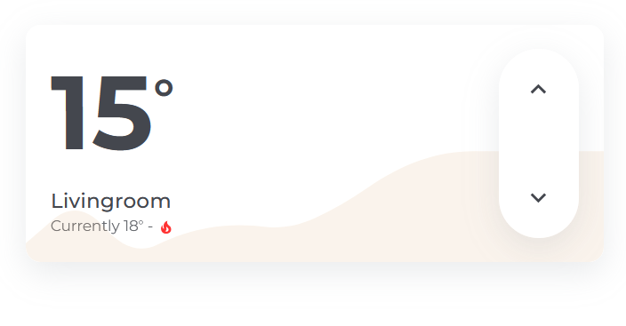

# Climate Card

The `hc_climate_card` shows the current and target temperatures and uses up/down buttons to change the target. Its background identifies the active HVAC mode; `off`, `unknown`, and `unavailable` retain the neutral card background.



## Usage

```yaml
  - type: custom:marao-card
    template: hc_climate_card
    entity: <climate entity>
```
## Variables

| Variable | Default | Required | Description|
|----------|---------|----------|------------|
| show_window_state | false | No | If true, the window state will be shown. |
| window_open_boolean |  | No | The entity that shows if the window is open. |
| show_mode_state | true | No | If true, the mode state will be shown as a icon next to the current temperature. |
| show_graph | false | No | If true, a graph will be shown as background. |
| graph_entity |  | No | The entity that will be shown in the graph. |
| graph_color | var(--color-red) | No | The color will be used for the graph. |

## State colors

| HVAC mode | Theme color |
|------------|-------------|
| Heat / heating | `--color-red` |
| Cool / cooling | `--color-blue` |
| Heat/Cool | `--color-purple` |
| Auto | `--color-gold` |
| Dry / drying | `--color-yellow` |
| Fan only | `--color-green` |

## Contribution
- [ptC7H12](https://github.com/ptC7H12)
