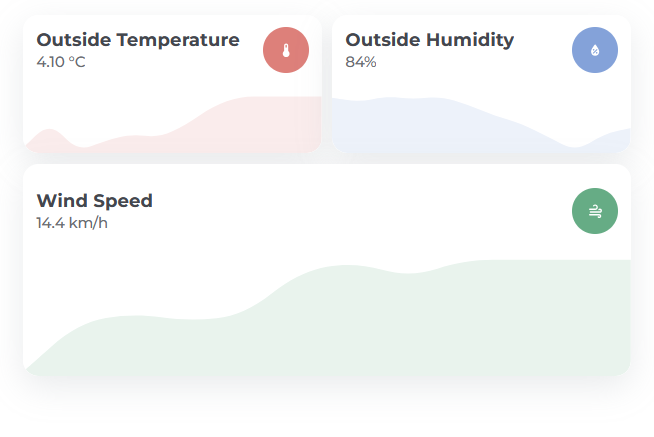

# Graph Card

The `hc_graph_card` is used for showing a graph of a sensor. It also shows the current state.



## Usage

```yaml
  - type: custom:button-card
    template: hc_graph_card
    entity: <sensor entity>
    variables:
      graph_color: <desired color>
```

## Variables

| Variable | Default | Required | Description|
|----------|---------|----------|------------|
| graph_color | var(--color-blue) | No | The color used for the graph line. |
| graph_background | | No | Card background override. |
| show_graph_line | false | No | Show the graph line. |
| show_graph_fill | false | No | Show the graph fill. |
| show_icon | false | No | Show the card icon. |
