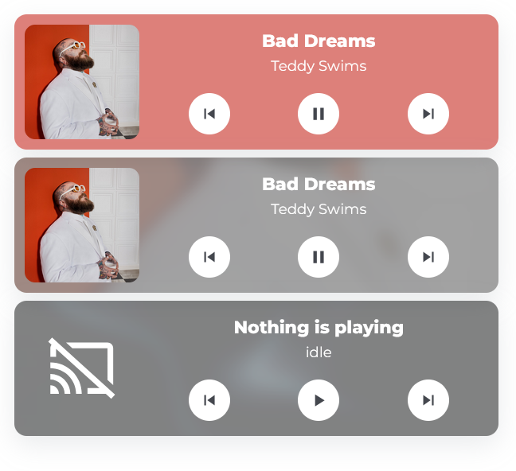

# Media Card

The `hc_media_card` opens a control popup when tapped. It can show album art as a
background and includes previous/play/next controls.



## Usage

```yaml
  - type: custom:button-card
    template: hc_media_card
    entity: <media entity>
```

Generated dashboards create the corresponding popup automatically. For a
manually authored dashboard, add a Bubble Card popup with the same `popup_hash`
as the media card.

## Apple TV

Apple TV is detected from the entity name, ID, device model, or manufacturer.
Set `apple_tv` explicitly when the automatic detection cannot identify it. Pass
the Apple TV remote and any app shortcuts in the entity configuration used by
the dashboard generator:

```json
{
  "entity_id": "media_player.living_room_apple_tv",
  "apple_tv": {
    "remote_entity": "remote.living_room_apple_tv",
    "volume_remote_entity": "remote.living_room_tv",
    "apps": [
      { "name": "YouTube", "source": "YouTube", "icon": "mdi:youtube" },
      { "name": "Plex", "source": "Plex", "icon": "mdi:plex" }
    ]
  }
}
```

App shortcuts appear first. The remote below follows the Apple TV layout: back,
up, home; left, select, right; rewind, down, fast-forward; then volume,
play/pause, volume. Without `volume_remote_entity`, the normal media-player
volume services are used.

## Variables

| Variable | Default | Required | Description|
|----------|---------|----------|------------|
| hc_show_background_art | true | No | If true, the background will show the album art. If nothing is playing, an animated GIF will play. |
| hc_background_color | var(--color-purple) | No | The background color used when `hc_show_background_art` is `false`. |
| popup_hash | `#media` | No | Bubble Card popup hash for manually authored dashboards. Generated dashboards set a unique value. |
