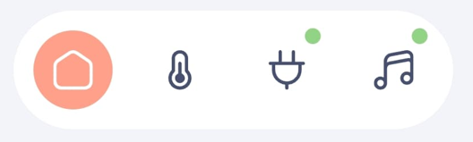

# Navigation bar card

`custom:marao-navbar-card` is Marao's project-owned floating mobile
navigation. The builder and generator create it automatically as the final
card in each generated view. It supports one to five routes and sizes the bar
from the number of entries.

## Manual usage

    type: custom:marao-navbar-card
    routes:
      - label: Home
        icon: mdi:home-variant-outline
        icon_selected: mdi:home-variant
        url: /marao-dashboard/overview
      - label: Rooms
        icon: mdi:sofa-outline
        icon_selected: mdi:sofa
        url: /marao-dashboard/rooms

Use the builder for generated dashboards so its route order, available pages,
translations, and five-entry validation stay aligned. A manually authored
view must also leave enough bottom content space for the floating bar.

## Route fields

| Field | Required | Description |
|:--|:--:|:--|
| `label` | Yes | Localized route name and the icon's internal accessible name. |
| `url` | Yes | Dashboard route. `path` is accepted as a compatibility alias. |
| `icon` | No | Inactive Material Design icon; defaults to `mdi:circle-outline`. |
| `icon_selected` | No | Filled/selected icon; falls back to `icon`. |

The bar deliberately shows icons without visible labels. The `label` is still
required for semantics and may be exposed as an optional tooltip; navigation
must never depend on a tooltip.

## Layout and behavior

- Every control is visibly at least 48 by 48 CSS pixels.
- Active icon backgrounds are perfect circles and use the Marao theme.
- Gaps remain compact while route width auto-scales.
- iPhone positioning derives from `env(safe-area-inset-bottom)` and keeps the
  accepted lowered offset without an extra generic bottom margin.
- Other mobile devices use the normal compact bottom offset.
- Button presses use Marao's strong haptic feedback.
- Open Marao popups remain above the navbar.
- The navbar activates Marao's route-scoped fullscreen shell, which hides Home
  Assistant's native top bar only while the dashboard is active.

Do not add a second navbar dependency or manually register a Lovelace resource.
The Marao integration owns and registers this component.
